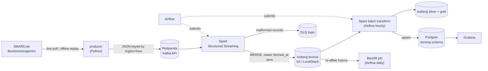

# de-energy-streaming

[](https://github.com/kaeldrin-gh/de-energy-streaming/actions/workflows/ci.yml)
[](https://www.python.org/)
[](LICENSE)

A real-time data platform for **German day-ahead electricity prices**: SMARD.de
(Bundesnetzagentur) → Kafka → Spark Structured Streaming → Apache Iceberg on
S3 → PostgreSQL/Grafana, orchestrated with Airflow and provisioned with
Terraform.

Everything runs **locally with Docker, without a single cloud account or paid
service** — and the code is written so the exact same Spark/Iceberg logic points
at real AWS S3 (or any S3-compatible object store) by changing environment
variables.

> Sibling project: [nl-energy-warehouse](https://github.com/kaeldrin-gh/nl-energy-warehouse)
> covers batch/dbt analytics engineering for Dutch power prices. This repo is
> the streaming + orchestration counterpart on the German market.

## What it demonstrates

| Skill | Where |
| --- | --- |
| Streaming ingestion (Kafka API) | Redpanda + keyed JSON messages, DLQ for malformed records |
| Spark Structured Streaming | `spark/jobs/stream_prices.py`: checkpointing, `foreachBatch`, MERGE |
| Apache Iceberg lakehouse | Bronze/silver/gold medallion on S3A (LocalStack locally, AWS-ready) |
| Revision-aware upserts | Idempotent ingestion: replays and corrections cannot corrupt history (ADR 0002) |
| Orchestration | Airflow DAGs submitting Spark jobs in client mode with retries |
| Infrastructure as code | Terraform provisions the lakehouse bucket against the real S3 API (LocalStack) |
| Serving layer | PostgreSQL upserts + provisioned Grafana dashboard + Prometheus/statsd metrics |
| Testing & CI | pytest (parsers, replay determinism, key stability), ruff, compose config + `terraform validate` in GitHub Actions |
| Operational maturity | Health-check DAG, runbook, incident-driven ADRs |

## Architecture



One namespace, three layers:

- **bronze** — one row per `(region, delivery_ts)`, revision-aware (newest
  `fetched_at` wins), partitioned by day
- **silver** — deduplicated and enriched with Europe/Berlin local time,
  weekend flag, peak/off-peak hour, negative-price flag
- **gold** — daily aggregates (`avg`/`min`/`max`, negative-price hours), written
  to both Iceberg and the Postgres serving schema

## Quickstart

Prerequisites: **Docker Desktop** (free; no account or payment required) with
~8 GB RAM available. On Windows, Docker Desktop needs WSL2 enabled.

```bash
git clone https://github.com/kaeldrin-gh/de-energy-streaming.git
cd de-energy-streaming

make up          # build + start Airflow, Spark, Redpanda, Postgres, LocalStack; provision S3
make demo        # replay the bundled real SMARD sample into Kafka (offline, deterministic)
make stream      # Kafka -> Iceberg bronze (foreground; Ctrl+C to stop)
```

Then open:

| Service | URL | Credentials |
| --- | --- | --- |
| Airflow | http://localhost:8088 | `admin` / `admin` |
| Spark master | http://localhost:8080 | — |
| Grafana (`make obs`) | http://localhost:3000 | `admin` / `admin` |
| LocalStack S3 | http://localhost:4566 | `test` / `test` |
| Kafka (host) | `localhost:9092` | — |

Trigger the batch layer from the Airflow UI (`energy_batch_pipeline`,
`energy_history_backfill`), or run it directly:

```bash
make backfill    # revision-aware backfill from the live SMARD API
```

Live ingestion needs **no API key**:

```bash
make live        # polls SMARD every 60 s and publishes new/changed hours
```

### What actually runs where

- `producer` (Python) fetches SMARD weekly chunks, validates them, and emits one
  Kafka message per delivery hour, keyed by `region|delivery_ts`.
- `stream_prices.py` parses, validates, and MERGEs micro-batches into
  `lake.energy.bronze_prices`; malformed records go to `energy.prices.invalid`.
- `backfill_prices.py` runs the **same MERGE** in batch mode, so history can be
  re-ingested at any time without regressing newer revisions.
- `transform_silver.py` rebuilds a 7-day sliding window into silver/gold
  (idempotent by construction) and upserts the serving tables for Grafana.
- `energy_healthcheck` DAG checks serving freshness (3 h SLA) every 30 minutes
  and records results in `serving.pipeline_health`.

## Data source

[SMARD.de](https://www.smard.de/) is the Bundesnetzagentur's market data
platform. The pipeline uses the public chart-data endpoints (filter `4169`,
region `DE-LU`, hourly resolution) — no key, no registration, verified against
the live service:

```
index : https://www.smard.de/app/chart_data/4169/DE-LU/index_hour.json
chunk : https://www.smard.de/app/chart_data/4169/DE-LU/4169_DE-LU_hour_<week>.json
```

`data/sample/latest.json` is **real captured data** (168 hours ending
2026-09-10), committed so the full pipeline demos without network access.
Refresh it any time with `make sample`.

## Testing

```bash
python -m pytest -q          # 10 unit tests, no Docker or network needed
python -m pytest -m integration -q   # live SMARD smoke test (network)
ruff check . && ruff format --check .
```

CI (`.github/workflows/ci.yml`) runs lint, tests, `docker compose config`, and
`terraform fmt -check` + `terraform validate` on every push.

## Configuration

All configuration is environment-driven with safe local defaults; see
`.env.example`. Nothing needs editing for the local stack. To point Spark at
real S3, set `S3_ENDPOINT`, `ICEBERG_WAREHOUSE`, `AWS_ACCESS_KEY_ID`, and
`AWS_SECRET_ACCESS_KEY` — no code changes.

## Design decisions

- [ADR 0001 — Local-first, zero-cost stack](docs/decisions/0001-local-first-zero-cost.md)
- [ADR 0002 — Revision-aware upserts instead of append-only ingestion](docs/decisions/0002-revision-aware-upserts.md)

Operational commands and failure modes: [docs/operations.md](docs/operations.md).

## Repository layout

```
producer/            SMARD client, Kafka sink, CLI (live / replay)
spark/jobs/          stream_prices.py, backfill_prices.py, transform_silver.py, common.py
airflow/dags/        batch pipeline + health check DAGs
terraform/           lakehouse bucket (LocalStack / AWS)
docker/              Dockerfiles, Postgres init SQL, Prometheus/Grafana provisioning
tests/               parser, replay, and message-contract tests
data/sample/         real captured SMARD data for offline runs
docs/decisions/      architecture decision records
```

## Roadmap

- Compaction/expiry maintenance job for the Iceberg tables
- OpenLineage/Marquez lineage between producer, Spark, and serving
- Weather join (DWD open data) for renewable-supply context
- Alert routing (email/webhook) on health-check failures
- Chef-of-the-month: `spark-submit` via Kubernetes in a kind cluster profile

## License

MIT — see [LICENSE](LICENSE). Data © Bundesnetzagentur / SMARD.de (DL-DE/BY-2.0).
