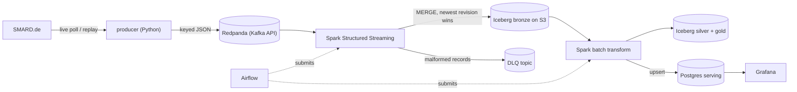

# de-energy-streaming

[](https://github.com/kaeldrin-gh/de-energy-streaming/actions/workflows/ci.yml)
[](LICENSE)

A streaming data platform for German day-ahead electricity prices. Market data
from SMARD.de (Bundesnetzagentur) flows through Kafka into Spark Structured
Streaming, lands in an Apache Iceberg lakehouse, and is modeled into hourly and
daily marts served through PostgreSQL and Grafana. Airflow orchestrates the
batch jobs; Terraform manages the storage layer. The full stack runs locally in
Docker with no cloud account, and the same Spark/Iceberg code points at AWS S3
by changing environment variables.

Batch counterpart: [nl-energy-warehouse](https://github.com/kaeldrin-gh/nl-energy-warehouse)
covers dbt-based analytics engineering on Dutch power prices.

## Architecture



One Iceberg namespace, three layers. **Bronze** keeps one row per
`(region, delivery_ts)` with revision-aware upserts, so replays and upstream
corrections cannot corrupt history (ADR 0002). **Silver** adds Berlin local
time, weekend and negative-price flags. **Gold** holds daily aggregates, also
upserted into the Postgres serving schema.

The jobs: `producer/` polls SMARD and publishes one message per delivery hour;
`spark/jobs/stream_prices.py` writes bronze and routes malformed records to a
dead-letter topic; `backfill_prices.py` loads history through the same MERGE;
`transform_silver.py` rebuilds silver and gold and refreshes serving; the
`energy_healthcheck` DAG verifies serving freshness every 30 minutes.

## Screenshots

| Grafana (serving layer) | Airflow (hourly Spark orchestration) |
| --- | --- |
|  |  |

Both are from the local stack; the Spark master UI is at
http://localhost:8080 once it is running.

## What the data says


Fourteen weeks of real prices (2,328 hours, June to September 2026), computed
from the marts and re-runnable with `make bi`:

| Metric | Value |
| --- | --- |
| Evening peak vs midday trough | €178 vs €38 per MWh |
| Hours priced below zero | 7.9% (minimum −€45.87/MWh) |
| Negative share, weekends vs weekdays | 20.5% vs 3.1% |
| Weekend midday vs weekday evening | −€0.83 vs €192 per MWh |

Full analysis, charts and caveats: [analysis/findings.md](analysis/findings.md).

## Quickstart

Requires Docker Desktop (free) with about 8 GB of RAM; on Windows, enable WSL2.

```bash
git clone https://github.com/kaeldrin-gh/de-energy-streaming.git
cd de-energy-streaming

make up        # start the stack and create the S3 bucket
make demo      # replay the bundled 168-hour SMARD sample (offline)
make stream    # run the Kafka to Iceberg streaming job (Ctrl+C to stop)

make live      # or poll SMARD every 60 seconds (no API key needed)
make backfill  # or load the last few weeks of history
make obs       # add Grafana and Prometheus
```

| Service | URL | Login |
| --- | --- | --- |
| Airflow | http://localhost:8088 | `admin` / `admin` |
| Spark master | http://localhost:8080 | |
| Grafana (`make obs`) | http://localhost:3000 | `admin` / `admin` |
| LocalStack S3 | http://localhost:4566 | `test` / `test` |

Configuration is environment-driven and the defaults in `.env.example` match
the compose stack, so nothing needs editing. Pointing Spark at real S3 means
setting `S3_ENDPOINT`, `ICEBERG_WAREHOUSE` and credentials; no code changes.

## Tests

```bash
python -m pytest -q                  # 10 unit tests, no Docker or network
python -m pytest -m integration -q   # live SMARD smoke test
ruff check . && ruff format --check .
```

CI runs lint, tests, `docker compose config`, and Terraform validation on every
push. Operational commands and failure modes are in
[docs/operations.md](docs/operations.md).

## Design notes

- [ADR 0001: local-first, zero-cost stack](docs/decisions/0001-local-first-zero-cost.md)
- [ADR 0002: revision-aware upserts](docs/decisions/0002-revision-aware-upserts.md)

## Layout

```
producer/       SMARD client, Kafka sink, CLIs
spark/jobs/     streaming, backfill and transform jobs
airflow/dags/   batch pipeline and health check
analysis/       BI queries, chart generation, findings
terraform/      lakehouse bucket (LocalStack or AWS)
docker/         images, Postgres init, Grafana and Prometheus provisioning
tests/          parser, replay and message contract tests
```

## Roadmap

- DWD weather join to attribute negative prices to wind and solar output
- Iceberg compaction and snapshot expiry job
- Alert routing for health-check failures

## License

MIT, see [LICENSE](LICENSE). Data © Bundesnetzagentur / SMARD.de (DL-DE/BY-2.0).
