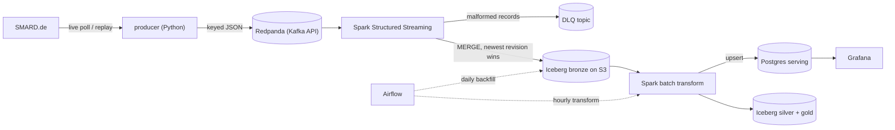
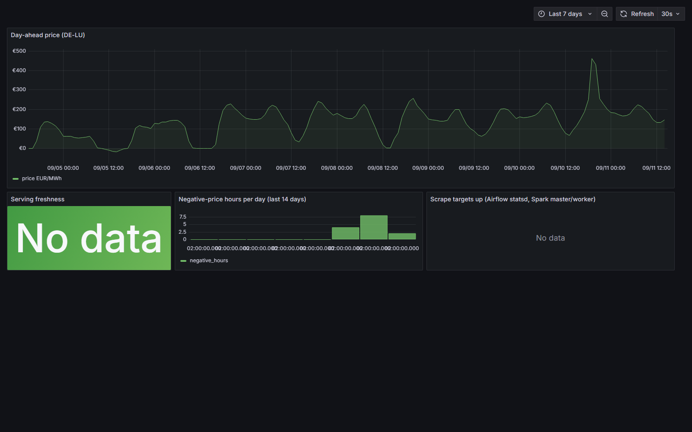
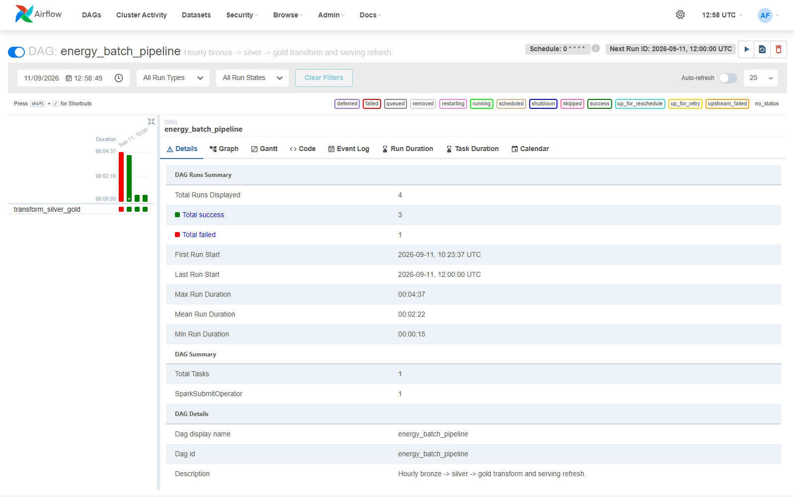
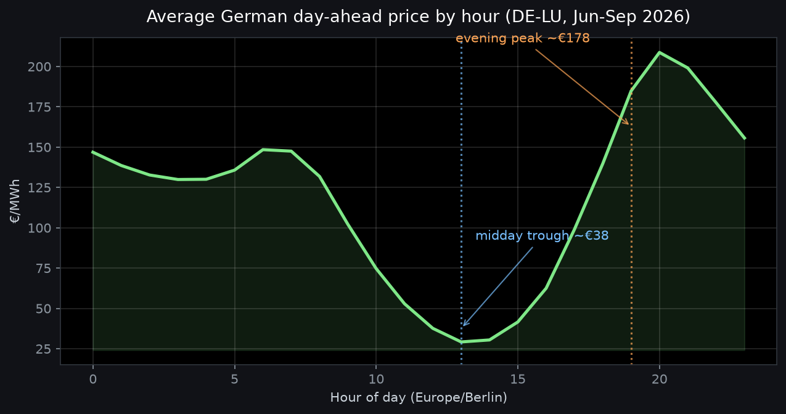

# de-energy-streaming

[](https://github.com/kaeldrin-gh/de-energy-streaming/actions/workflows/ci.yml)
[](LICENSE)
[](https://github.com/kaeldrin-gh/de-energy-streaming/actions/workflows/showcase.yml)

**[Live showcase](https://kaeldrin-gh.github.io/de-energy-streaming/)** — market pulse, findings charts and screenshots, rebuilt daily

A streaming data platform for German day-ahead electricity prices. Market data
from SMARD.de (Bundesnetzagentur) flows through Kafka into Spark Structured
Streaming, lands in an Apache Iceberg lakehouse, and is modeled into hourly and
daily marts served through PostgreSQL and Grafana. Airflow orchestrates the
batch jobs; Terraform manages the storage layer. The full stack runs locally in
Docker with no cloud account, and the same Spark/Iceberg code points at AWS S3
by changing environment variables.

Batch counterpart: [nl-energy-warehouse](https://github.com/kaeldrin-gh/nl-energy-warehouse)
covers dbt-based analytics engineering on Dutch power prices.

## Architecture



The streaming job is a long-running process (started with `make stream`);
Airflow owns the batch side: the hourly transform, the daily backfill, the
freshness health check, and an optional daily news ingest (ADR 0003).

One Iceberg namespace, three layers. **Bronze** keeps one row per
`(region, delivery_ts)` with revision-aware upserts, so replays and upstream
corrections cannot corrupt history (ADR 0002). **Silver** adds Berlin local
time, weekend and negative-price flags. **Gold** holds daily aggregates, also
upserted into the Postgres serving schema.

The jobs: `producer/` polls SMARD and publishes one message per delivery hour;
`spark/jobs/stream_prices.py` writes bronze and routes malformed records to a
dead-letter topic; `backfill_prices.py` loads history through the same MERGE;
`transform_silver.py` rebuilds silver and gold and refreshes serving;
`news_ingest.py` classifies public energy-news headlines into Iceberg as an
optional qualitative layer (ADR 0003); the `energy_healthcheck` DAG verifies
serving freshness every 30 minutes.

## Screenshots

| Grafana (serving layer) | Airflow (hourly Spark orchestration) |
| --- | --- |
|  |  |

Both are from the local stack; the Spark master UI is at
http://localhost:8080 once it is running.

## What the data says



Fourteen weeks of real prices (2,328 hours, June to September 2026), computed
from the marts and re-runnable with `make bi`:

| Metric | Value |
| --- | --- |
| Evening peak vs midday trough | €178 vs €38 per MWh |
| Hours priced below zero | 7.9% (minimum −€45.87/MWh) |
| Negative share, weekends vs weekdays | 20.5% vs 3.1% |
| Weekend midday vs weekday evening | −€0.83 vs €192 per MWh |

Full analysis, charts and caveats: [analysis/findings.md](analysis/findings.md).

## News context (optional)

`make news` fetches public energy-news headlines (pv-magazine, Clean Energy
Wire, Solarserver) and classifies each one through
[classifier.dev](https://classifier.dev) - a keyless, free HTTP classifier that
returns a calibrated confidence per label - into `grid and infrastructure /
policy and regulation / power prices and markets / gas / renewables / batteries
and storage / hydrogen / companies and projects / weather`. Headlines whose
topic is `none of these` are stored with a NULL category (unrelated news never
pollutes the analytics), and the reports show the energy topics plus how many
headlines were general news and filtered out. Headlines land in
`lake.energy.news_events` and can be joined to price days:

```sql
SELECT date_trunc('day', n.published_ts) AS day, n.category, count(*)
FROM lake.energy.news_events n
WHERE n.category IS NOT NULL
GROUP BY 1, 2
ORDER BY 1 DESC;
```

The job is optional and fails soft (ADR 0003): if the classifier is down,
headlines are stored with a NULL category and the next run reclassifies them.
The endpoint can be overridden with `CLASSIFIER_URL` and the feeds with
`NEWS_FEEDS` (see `.env.example`); there is no account, key, or cost. The daily
market pulse on its run page also lists the latest headlines per topic
(`--no-news` for a pure-price pulse).

## Quickstart

Requires Docker Desktop (free) with about 8 GB of RAM; on Windows, enable WSL2.

```bash
git clone https://github.com/kaeldrin-gh/de-energy-streaming.git
cd de-energy-streaming

make up        # start the stack and create the S3 bucket
make demo      # replay the bundled 168-hour SMARD sample (offline)
make stream    # run the Kafka to Iceberg streaming job (Ctrl+C to stop)

make live      # or poll SMARD every 60 seconds (no API key needed)
make backfill  # or load the last few weeks of history
make news      # or classify public energy-news headlines (optional, ADR 0003)
make obs       # add Grafana and Prometheus
```

| Service | URL | Login |
| --- | --- | --- |
| Airflow | http://localhost:8088 | `admin` / `admin` |
| Spark master | http://localhost:8080 | |
| Grafana (`make obs`) | http://localhost:3000 | `admin` / `admin` |
| LocalStack S3 | http://localhost:4566 | `test` / `test` |

Configuration is environment-driven and the defaults in `.env.example` match
the compose stack, so nothing needs editing. Pointing Spark at real S3 means
setting `S3_ENDPOINT`, `ICEBERG_WAREHOUSE` and credentials; no code changes.

## Tests

```bash
python -m pytest -q                  # fast unit tests, no Docker or network
python -m pytest -m integration -q   # live SMARD smoke test
ruff check . && ruff format --check .
```

Two heavier suites run in CI rather than requiring a local install:

- `tests/test_bronze_merge.py` starts a local Spark + Iceberg session and proves
  the revision-aware MERGE is idempotent: replaying a batch converges to one
  row per `(region, delivery_ts)`, and a stale revision never overwrites a
  newer one. Run it locally with `pip install -e ".[sparklocal]"` on a machine
  with a JVM.
- `tests/test_dags.py` imports every DAG through Airflow's DagBag and checks
  that each Spark task still points at an existing job with the expected
  arguments, so broken DAGs fail the build before they reach the scheduler.

CI runs lint, unit tests, both suites above, `docker compose config`, and
Terraform validation on every push, and renders a consolidated result table on
the run page. A daily `market-summary` workflow renders the latest published
SMARD.de prices and the classified news headlines on its run page
(`python -m producer summary`). Operational commands and failure modes are in
[docs/operations.md](docs/operations.md).

## Design notes

- [ADR 0001: local-first, zero-cost stack](docs/decisions/0001-local-first-zero-cost.md)
- [ADR 0002: revision-aware upserts](docs/decisions/0002-revision-aware-upserts.md)
- [ADR 0003: optional news enrichment](docs/decisions/0003-optional-news-enrichment.md)

## Layout

```
producer/       SMARD client, Kafka sink, news feeds, CLIs
spark/jobs/     streaming, backfill, transform and news jobs
airflow/dags/   batch pipelines, news ingest and health check
analysis/       BI queries, chart generation, findings
terraform/      lakehouse bucket (LocalStack or AWS)
docker/         images, Postgres init, Grafana and Prometheus provisioning
tests/          parsers, replay/contract, MERGE idempotency, DAGs, news
```

## Roadmap

- DWD weather join to attribute negative prices to wind and solar output
- Iceberg compaction and snapshot expiry job
- Alert routing for health-check failures

## License

MIT, see [LICENSE](LICENSE). Data © Bundesnetzagentur / SMARD.de (DL-DE/BY-2.0).
