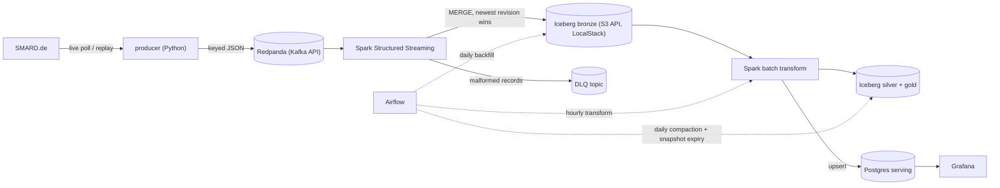

# de-energy-streaming

[](https://github.com/kaeldrin-gh/de-energy-streaming/actions/workflows/ci.yml)
[](LICENSE)
[](https://github.com/kaeldrin-gh/de-energy-streaming/actions/workflows/showcase.yml)

**[Live showcase](https://kaeldrin-gh.github.io/de-energy-streaming/)** — market pulse, findings charts and screenshots, rebuilt daily

This project is a streaming data platform for German day-ahead electricity
prices. A Python producer reads market data from SMARD.de (Bundesnetzagentur)
and sends it to Kafka. Spark Structured Streaming writes the data to an Apache
Iceberg lakehouse. Batch jobs make hourly and daily marts from it and write them
to PostgreSQL. Grafana shows the marts.

Airflow controls the batch jobs. Terraform manages the storage bucket. The full
stack runs locally in Docker and needs no cloud account. Storage uses the S3
API (LocalStack).

**Stack:** Python · Kafka (Redpanda) · Spark Structured Streaming · Apache Iceberg · Airflow · PostgreSQL · Grafana · Terraform · GitHub Actions

Batch counterpart: [nl-energy-warehouse](https://github.com/kaeldrin-gh/nl-energy-warehouse)
covers dbt-based analytics engineering on Dutch power prices.
Managed-platform counterpart: [databricks-energy-quality](https://github.com/kaeldrin-gh/databricks-energy-quality)
covers the same domain on Databricks (Unity Catalog, Delta, Lakeflow pipelines,
Workflows).

## Where to look first

| If you have | Read |
| --- | --- |
| 2 minutes | The architecture below and the [live showcase](https://kaeldrin-gh.github.io/de-energy-streaming/) |
| 10 minutes | `merge_bronze_from_view` in [spark/jobs/common.py](spark/jobs/common.py) (the revision-aware MERGE) and the tests that prove it in [tests/test_bronze_merge.py](tests/test_bronze_merge.py) |
| A design discussion | [Event-driven patterns](docs/event-driven-patterns.md) and [ADR 0002: revision-aware upserts](docs/decisions/0002-revision-aware-upserts.md) |
| An operations view | The [runbook](docs/operations.md): failure modes, table maintenance, recovery |

## Architecture


```mermaid
flowchart LR
    SMARD["SMARD.de"] -->|live poll / replay| P["producer (Python)"]
    P -->|keyed JSON| K[("Redpanda (Kafka API)")]
    K --> S["Spark Structured Streaming"]
    S -->|"MERGE, newest revision wins"| B[("Iceberg bronze (S3 API, LocalStack)")]
    S -->|malformed records| D[("DLQ topic")]
    B --> T["Spark batch transform"]
    T --> SI[("Iceberg silver + gold")]
    T -->|upsert| PG[("Postgres serving")]
    PG --> G["Grafana"]
    A["Airflow"] -. hourly transform .-> T
    A -. daily backfill .-> B
    A -. daily compaction + snapshot expiry .-> SI
```

The streaming job runs continuously. Start it with `make stream`. Airflow
controls the batch jobs:

- the hourly transform
- the daily backfill
- the daily table maintenance
- the freshness health check, every 30 minutes
- the optional daily news ingest (ADR 0003)

The lakehouse has one Iceberg namespace with three layers:

- **Bronze** keeps one row for each `(region, delivery_ts)`. Each write is a
  revision-aware upsert. Thus, replays and upstream corrections cannot change
  the history incorrectly (ADR 0002).
- **Silver** adds the Berlin local time, a weekend flag and a negative-price
  flag.
- **Gold** keeps the daily aggregates. The transform also writes them to the
  Postgres serving schema.

The Postgres catalog and the LocalStack files use different Docker volumes.
If LocalStack loses its files and the catalog keeps its entries, each job
removes these orphaned entries when it starts. Then the stream loads bronze
again from Kafka.

The jobs:

| Job | What it does |
| --- | --- |
| `producer/` | Reads SMARD and sends one message for each delivery hour |
| `spark/jobs/stream_prices.py` | Writes bronze. Sends malformed records to a dead-letter topic |
| `backfill_prices.py` | Loads history with the same MERGE as the stream |
| `transform_silver.py` | Makes silver and gold again and updates the serving tables |
| `news_ingest.py` | Puts public energy-news headlines with a topic into Iceberg (optional, ADR 0003) |
| `maintain_tables.py` | Merges the small files from each micro-batch. Removes snapshots older than seven days, and keeps a minimum of ten for time travel |
| `energy_healthcheck` DAG | Checks every 30 minutes that the serving tables are current |

## Screenshots

| Grafana (serving layer) | Airflow (hourly Spark orchestration) |
| --- | --- |
|  |  |

Both come from the local stack (`make up`, then `make obs` for Grafana).

## What the data says


Sixteen weeks of real prices (2,712 hours, 8 June to 28 September 2026),
computed from the marts and re-runnable with `make bi`:

| Metric | Value |
| --- | --- |
| Evening peak vs midday trough | €188 vs €40 per MWh |
| Hours priced below zero | 7.5% (minimum −€45.87/MWh) |
| Negative share, weekends vs weekdays | 19.7% vs 2.7% |
| Weekend midday vs weekday evening | €2.98 vs €206 per MWh |

Full analysis, charts and caveats: [analysis/findings.md](analysis/findings.md).

## Quickstart

You must have Docker Desktop (free) with approximately 8 GB of RAM. On Windows,
enable WSL2.

```bash
git clone https://github.com/kaeldrin-gh/de-energy-streaming.git
cd de-energy-streaming

make up        # start the stack and create the S3 bucket
make demo      # replay the bundled 168-hour SMARD sample (offline)
make stream    # run the Kafka to Iceberg streaming job (Ctrl+C to stop)

make live      # or poll SMARD every 60 seconds (no API key needed)
make backfill  # or load the last few weeks of history
make news      # or classify public energy-news headlines (optional, ADR 0003)
make maintain  # compact Iceberg files, expire old snapshots (Airflow does this daily)
make obs       # add Grafana and Prometheus
```

| Service | URL | Login |
| --- | --- | --- |
| Airflow | http://localhost:8088 | `admin` / `admin` |
| Spark master | http://localhost:8080 | |
| Grafana (`make obs`) | http://localhost:3000 | `admin` / `admin` |
| LocalStack S3 | http://localhost:4566 | `test` / `test` |

Environment variables control the configuration. The defaults in
`.env.example` agree with the compose stack, so you do not have to change them.
The variables `S3_ENDPOINT`, `ICEBERG_WAREHOUSE` and the credentials set the
storage endpoint. The code does not contain it. The tests use only LocalStack.

## Tests

```bash
python -m pytest -q                  # fast unit tests, no Docker or network
python -m pytest -m integration -q   # live SMARD smoke test
ruff check . && ruff format --check .
```

CI runs the larger test suites, so you do not have to install their tools
locally:

- `tests/test_bronze_merge.py` starts a local Spark + Iceberg session. It shows
  that the revision-aware MERGE is idempotent. A replayed batch gives one row
  for each `(region, delivery_ts)`. An old revision never replaces a newer one.
- `tests/test_table_maintenance.py` uses the same session. It shows that
  compaction merges many small files into one and does not change rows.
  Snapshot expiry never removes a snapshot inside the retention period. A
  second run on a compacted table does not write files again.
- `tests/test_catalog_recovery.py` uses a JDBC catalog on SQLite. This is the
  same catalog type as the Postgres catalog of the stack. The test deletes the
  warehouse files. Then it shows that the next job start makes the tables again
  and does not fail. Tables that still have their files do not change.
- `tests/test_dags.py` loads each DAG through the Airflow DagBag. It checks
  that each Spark task points to a job that exists, with the correct
  arguments. Thus, a broken DAG makes the build fail before it gets to the
  scheduler.

To run the first three suites locally, use a computer with a JVM and install
the extra: `pip install -e ".[sparklocal]"`.

For each push, CI runs the lint, the unit tests, the suites above,
`docker compose config` and the Terraform validation. It shows one table with
all results on the run page.

Each day, the `market-summary` workflow shows the latest SMARD.de prices and
the news headlines with their topics on its run page
(`python -m producer summary`). If the run fails, the workflow opens a GitHub
issue. It does not open a second issue while one is open. Thus, an outage
always becomes visible.

For the operation commands and the failure modes, refer to
[docs/operations.md](docs/operations.md).

## Design notes

- [Event-driven patterns: delivery, ordering, retries, DLQ, replay](docs/event-driven-patterns.md)
- [ADR 0001: local-first, zero-cost stack](docs/decisions/0001-local-first-zero-cost.md)
- [ADR 0002: revision-aware upserts](docs/decisions/0002-revision-aware-upserts.md)
- [ADR 0003: optional news enrichment](docs/decisions/0003-optional-news-enrichment.md)

## News context (optional)

`make news` gets public energy-news headlines from pv-magazine, Clean Energy
Wire and Solarserver. It sends each headline to
[classifier.dev](https://classifier.dev), a free HTTP classifier that needs no
key. For each headline, the classifier gives a calibrated confidence for each
topic. The topics are: `grid and infrastructure / policy and regulation /
power prices and markets / gas / renewables / batteries and storage / hydrogen
/ companies and projects / weather`.

If the topic is `none of these`, the job keeps the headline with a NULL
category. Thus, unrelated news does not change the analytics. The reports show
the energy topics and the number of general headlines that they do not include.
The headlines go into `lake.energy.news_events`. You can join them to the price
days:

```sql
SELECT date_trunc('day', n.published_ts) AS day, n.category, count(*)
FROM lake.energy.news_events n
WHERE n.category IS NOT NULL
GROUP BY 1, 2
ORDER BY 1 DESC;
```

The news job is optional. A failure in it does not stop the price pipeline
(ADR 0003). If the classifier is not available, the job keeps the headlines
with a NULL category. The next run gives them a topic.

To change the endpoint, set `CLASSIFIER_URL`. To change the feeds, set
`NEWS_FEEDS` (refer to `.env.example`). The classifier needs no account and no
key, and it is free. The daily market pulse also shows the latest headlines for
each topic on its run page. To show only prices, use `--no-news`.

## Layout

```
producer/       SMARD client, Kafka sink, news feeds, CLIs
spark/jobs/     streaming, backfill, transform, maintenance and news jobs
airflow/dags/   batch pipelines, news ingest and health check
analysis/       BI queries, chart generation, findings
terraform/      lakehouse bucket (LocalStack, S3 API)
docker/         images, Postgres init, Grafana and Prometheus provisioning
docs/           ADRs, the operations runbook and the event-driven patterns page
tests/          parsers, replay/contract, MERGE idempotency, table maintenance, catalog recovery, DAGs, news
```

## Roadmap

- DWD weather join to attribute negative prices to wind and solar output

## License

MIT, see [LICENSE](LICENSE). Data © Bundesnetzagentur / SMARD.de (DL-DE/BY-2.0).
