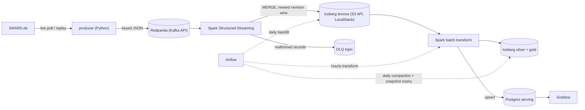
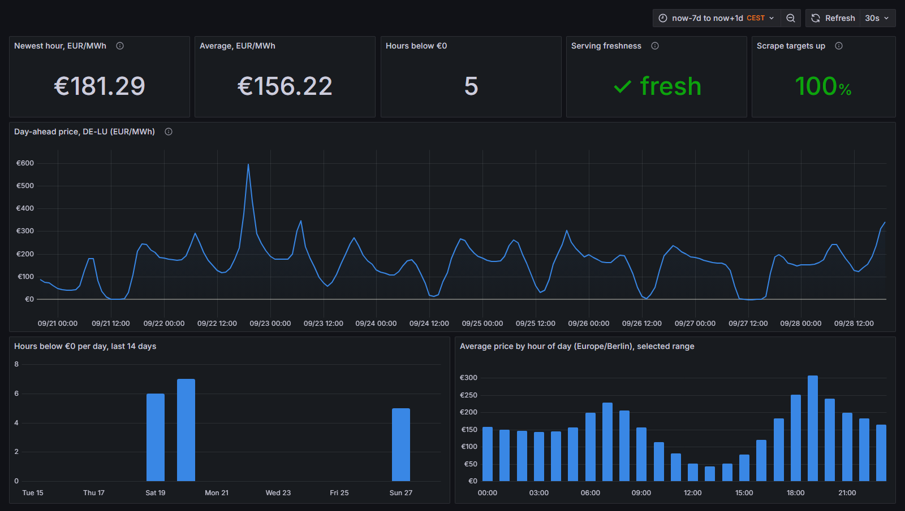
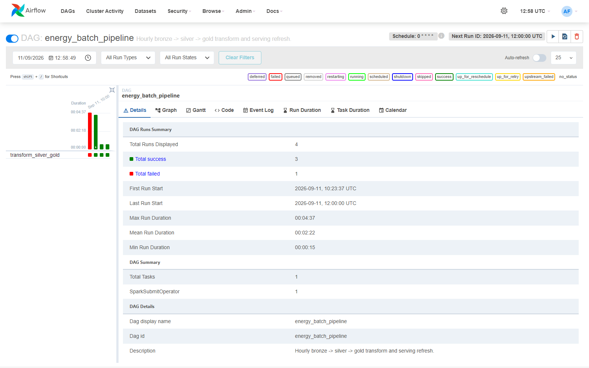
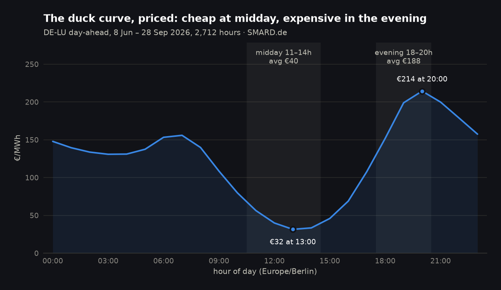

# de-energy-streaming

[](https://github.com/kaeldrin-gh/de-energy-streaming/actions/workflows/ci.yml)
[](LICENSE)
[](https://github.com/kaeldrin-gh/de-energy-streaming/actions/workflows/showcase.yml)

**[Live showcase](https://kaeldrin-gh.github.io/de-energy-streaming/)** — market pulse, findings charts and screenshots, rebuilt daily

A streaming data platform for German day-ahead electricity prices. Market data
from SMARD.de (Bundesnetzagentur) flows through Kafka into Spark Structured
Streaming, lands in an Apache Iceberg lakehouse, and is modeled into hourly and
daily marts served through PostgreSQL and Grafana. Airflow orchestrates the
batch jobs; Terraform manages the storage layer. The full stack runs locally in
Docker with no cloud account, with storage behind the S3 API (LocalStack).

**Stack:** Python · Kafka (Redpanda) · Spark Structured Streaming · Apache Iceberg · Airflow · PostgreSQL · Grafana · Terraform · GitHub Actions

Batch counterpart: [nl-energy-warehouse](https://github.com/kaeldrin-gh/nl-energy-warehouse)
covers dbt-based analytics engineering on Dutch power prices.
Managed-platform counterpart: [databricks-energy-quality](https://github.com/kaeldrin-gh/databricks-energy-quality)
covers the same domain on Databricks (Unity Catalog, Delta, Lakeflow pipelines,
Workflows).

## Where to look first

| If you have | Read |
| --- | --- |
| 2 minutes | The architecture below and the [live showcase](https://kaeldrin-gh.github.io/de-energy-streaming/) |
| 10 minutes | `merge_bronze_from_view` in [spark/jobs/common.py](spark/jobs/common.py) (the revision-aware MERGE) and the tests that prove it in [tests/test_bronze_merge.py](tests/test_bronze_merge.py) |
| A design discussion | [Event-driven patterns](docs/event-driven-patterns.md) and [ADR 0002: revision-aware upserts](docs/decisions/0002-revision-aware-upserts.md) |
| An operations view | The [runbook](docs/operations.md): failure modes, table maintenance, recovery |

## Architecture


```mermaid
flowchart LR
    SMARD["SMARD.de"] -->|live poll / replay| P["producer (Python)"]
    P -->|keyed JSON| K[("Redpanda (Kafka API)")]
    K --> S["Spark Structured Streaming"]
    S -->|"MERGE, newest revision wins"| B[("Iceberg bronze (S3 API, LocalStack)")]
    S -->|malformed records| D[("DLQ topic")]
    B --> T["Spark batch transform"]
    T --> SI[("Iceberg silver + gold")]
    T -->|upsert| PG[("Postgres serving")]
    PG --> G["Grafana"]
    A["Airflow"] -. hourly transform .-> T
    A -. daily backfill .-> B
    A -. daily compaction + snapshot expiry .-> SI
```

The streaming job is a long-running process (started with `make stream`);
Airflow owns the batch side: the hourly transform, the daily backfill, the
daily table maintenance, the freshness health check, and an optional daily news
ingest (ADR 0003).

One Iceberg namespace, three layers. **Bronze** keeps one row per
`(region, delivery_ts)` with revision-aware upserts, so replays and upstream
corrections cannot corrupt history (ADR 0002). If the LocalStack volume is lost
while the Postgres catalog survives, every job drops the orphaned entries on
start and the stream rebuilds bronze from Kafka. **Silver** adds Berlin local
time, weekend and negative-price flags. **Gold** holds daily aggregates, also
upserted into the Postgres serving schema.

The jobs: `producer/` polls SMARD and publishes one message per delivery hour;
`spark/jobs/stream_prices.py` writes bronze and routes malformed records to a
dead-letter topic; `backfill_prices.py` loads history through the same MERGE;
`transform_silver.py` rebuilds silver and gold and refreshes serving;
`news_ingest.py` classifies public energy-news headlines into Iceberg as an
optional qualitative layer (ADR 0003); `maintain_tables.py` compacts the small
files every micro-batch leaves behind and expires snapshots older than a week
(keeping at least ten for time travel); the `energy_healthcheck` DAG verifies
serving freshness every 30 minutes.

## Screenshots

| Grafana (serving layer) | Airflow (hourly Spark orchestration) |
| --- | --- |
|  |  |

Both are from the local stack; the Spark master UI is at
http://localhost:8080 once it is running.

## What the data says



Sixteen weeks of real prices (2,712 hours, 8 June to 28 September 2026),
computed from the marts and re-runnable with `make bi`:

| Metric | Value |
| --- | --- |
| Evening peak vs midday trough | €188 vs €40 per MWh |
| Hours priced below zero | 7.5% (minimum −€45.87/MWh) |
| Negative share, weekends vs weekdays | 19.7% vs 2.7% |
| Weekend midday vs weekday evening | €2.98 vs €206 per MWh |

Full analysis, charts and caveats: [analysis/findings.md](analysis/findings.md).

## Quickstart

Requires Docker Desktop (free) with about 8 GB of RAM; on Windows, enable WSL2.

```bash
git clone https://github.com/kaeldrin-gh/de-energy-streaming.git
cd de-energy-streaming

make up        # start the stack and create the S3 bucket
make demo      # replay the bundled 168-hour SMARD sample (offline)
make stream    # run the Kafka to Iceberg streaming job (Ctrl+C to stop)

make live      # or poll SMARD every 60 seconds (no API key needed)
make backfill  # or load the last few weeks of history
make news      # or classify public energy-news headlines (optional, ADR 0003)
make maintain  # compact Iceberg files, expire old snapshots (Airflow does this daily)
make obs       # add Grafana and Prometheus
```

| Service | URL | Login |
| --- | --- | --- |
| Airflow | http://localhost:8088 | `admin` / `admin` |
| Spark master | http://localhost:8080 | |
| Grafana (`make obs`) | http://localhost:3000 | `admin` / `admin` |
| LocalStack S3 | http://localhost:4566 | `test` / `test` |

Configuration is environment-driven and the defaults in `.env.example` match
the compose stack, so nothing needs editing. The storage endpoint is set by
`S3_ENDPOINT`, `ICEBERG_WAREHOUSE` and credentials rather than in code; only
LocalStack has been tested.

## Tests

```bash
python -m pytest -q                  # fast unit tests, no Docker or network
python -m pytest -m integration -q   # live SMARD smoke test
ruff check . && ruff format --check .
```

The heavier suites run in CI rather than requiring a local install:

- `tests/test_bronze_merge.py` starts a local Spark + Iceberg session and proves
  the revision-aware MERGE is idempotent: replaying a batch converges to one
  row per `(region, delivery_ts)`, and a stale revision never overwrites a
  newer one.
- `tests/test_table_maintenance.py` uses the same session to prove compaction
  turns many small files into one without changing a row, snapshot expiry
  never removes anything inside the retention window, and a re-run on a
  compacted table rewrites nothing.
- `tests/test_catalog_recovery.py` wipes the warehouse behind a SQLite-backed
  JDBC catalog (the same catalog type as the stack's Postgres) and proves the
  next job start recreates the tables instead of failing, while tables that
  still have their files are left alone. Run all three locally with
  `pip install -e ".[sparklocal]"` on a machine with a JVM.
- `tests/test_dags.py` imports every DAG through Airflow's DagBag and checks
  that each Spark task still points at an existing job with the expected
  arguments, so broken DAGs fail the build before they reach the scheduler.

CI runs lint, unit tests, the suites above, `docker compose config`, and
Terraform validation on every push, and renders a consolidated result table on
the run page. A daily `market-summary` workflow renders the latest published
SMARD.de prices and the classified news headlines on its run page
(`python -m producer summary`); if that run fails it opens one GitHub issue
(deduplicated while an issue is open), so an outage does not pass silently.
Operational commands and failure modes are in
[docs/operations.md](docs/operations.md).

## News context (optional)

`make news` fetches public energy-news headlines (pv-magazine, Clean Energy
Wire, Solarserver) and classifies each one through
[classifier.dev](https://classifier.dev) - a keyless, free HTTP classifier that
returns a calibrated confidence per label - into `grid and infrastructure /
policy and regulation / power prices and markets / gas / renewables / batteries
and storage / hydrogen / companies and projects / weather`. Headlines whose
topic is `none of these` are stored with a NULL category (unrelated news never
pollutes the analytics), and the reports show the energy topics plus how many
headlines were general news and filtered out. Headlines land in
`lake.energy.news_events` and can be joined to price days:

```sql
SELECT date_trunc('day', n.published_ts) AS day, n.category, count(*)
FROM lake.energy.news_events n
WHERE n.category IS NOT NULL
GROUP BY 1, 2
ORDER BY 1 DESC;
```

The job is optional and fails soft (ADR 0003): if the classifier is down,
headlines are stored with a NULL category and the next run reclassifies them.
The endpoint can be overridden with `CLASSIFIER_URL` and the feeds with
`NEWS_FEEDS` (see `.env.example`); there is no account, key, or cost. The daily
market pulse on its run page also lists the latest headlines per topic
(`--no-news` for a pure-price pulse).

## Design notes

- [Event-driven patterns: delivery, ordering, retries, DLQ, replay](docs/event-driven-patterns.md)
- [ADR 0001: local-first, zero-cost stack](docs/decisions/0001-local-first-zero-cost.md)
- [ADR 0002: revision-aware upserts](docs/decisions/0002-revision-aware-upserts.md)
- [ADR 0003: optional news enrichment](docs/decisions/0003-optional-news-enrichment.md)

## Layout

```
producer/       SMARD client, Kafka sink, news feeds, CLIs
spark/jobs/     streaming, backfill, transform, maintenance and news jobs
airflow/dags/   batch pipelines, news ingest and health check
analysis/       BI queries, chart generation, findings
terraform/      lakehouse bucket (LocalStack, S3 API)
docker/         images, Postgres init, Grafana and Prometheus provisioning
docs/           ADRs, the operations runbook and the event-driven patterns page
tests/          parsers, replay/contract, MERGE idempotency, table maintenance, catalog recovery, DAGs, news
```

## Roadmap

- DWD weather join to attribute negative prices to wind and solar output

## License

MIT, see [LICENSE](LICENSE). Data © Bundesnetzagentur / SMARD.de (DL-DE/BY-2.0).
