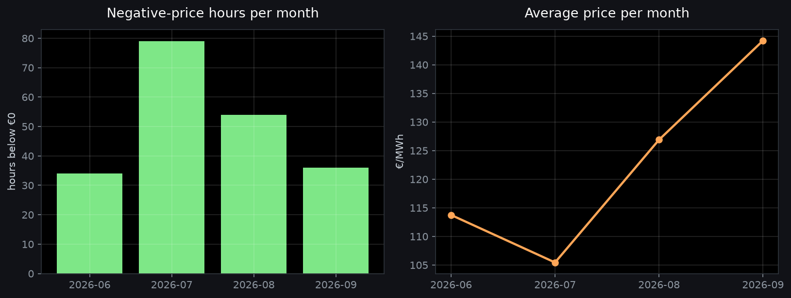
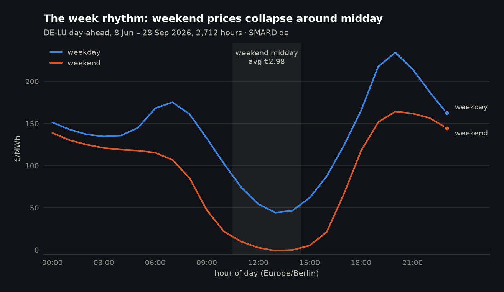

# Findings: what actually drives the German day-ahead price?

**Data**: 2,712 hourly day-ahead prices for the **DE-LU bidding zone**, 8 June – 28 September
2026 (16 complete weeks plus Monday 28 September, published a day ahead), ingested from
SMARD.de into this repository's own warehouse and merged with revision-aware upserts. Every
hour in the window matched SMARD's published value at the time of the last refresh
(27 September 2026).

Every number below is re-runnable from the marts:

```bash
make bi                          # the SQL in analysis/bi_queries.sql
python analysis/make_charts.py   # regenerates the charts in docs/images/
```

## The answer in four numbers

| | |
| --- | --- |
| **€188 vs €40** | evening peak (18–20h) vs midday trough (11–14h) — the duck curve, priced |
| **7.5%** | share of all hours priced below zero (203 hours; the minimum was **−€45.87/MWh**) |
| **19.7% vs 2.7%** | share of hours below zero on weekends vs weekdays |
| **€2.98 vs €206** | average weekend-midday price vs weekday-evening price — the cheapest window of the week is *nearly free* |

The practical takeaway: a weekend midday is the cheapest window of the German
electricity week. Power over 11:00–14:00 on weekends averaged €2.98/MWh, while a
weekday evening (18:00–20:00) cost €205.73/MWh, a gap of about €203/MWh. In the
earlier 14-week window (to 12 September) the same average was −€0.83/MWh. One day
lifted it above zero: Sunday 13 September averaged €100.09/MWh at midday. 24 of the 32
weekend days still averaged below zero over 11:00–14:00.

## 1. The duck curve, priced


Averaged over 113 days, the shape is stark: the **13:00 hour averages €31.52/MWh** while
**20:00 averages €214.42/MWh** — a 6.8× swing *within the same day*. The solar midday floods
the market; the evening ramp, when solar is gone and demand peaks, is where the price lives.

## 2. Negative prices are a summer, weekend phenomenon



203 of 2,712 hours (7.5%) cleared below zero over the window, and 38 of 113 days contained
at least one negative hour. The worst days were 13–14 June with **10 negative hours each**
(that Saturday averaged just €26.82/MWh). Monthly counts:

| Month | Negative hours | Avg price | Min price |
| --- | --- | --- | --- |
| June 2026 (from 8 June) | 34 | €113.75 | −€45.87 |
| July 2026 | 79 | €105.45 | −€12.28 |
| August 2026 | 54 | €126.89 | −€12.15 |
| September 2026 (to 28 September) | 36 | €144.22 | −€19.00 |

The weekday/weekend split is even sharper than the seasonal one: **19.7% of weekend hours
were negative vs 2.7% on weekdays** — industrial demand disappears exactly when solar
output peaks.

## 3. The week rhythm



Weekends average **€88.84/MWh against €135.98 on weekdays (−35%)**, but the difference is
not uniform: it is concentrated midday, where the weekend curve collapses to around zero
while the weekday curve stays well above it. A consumer with flexible load
should think in terms of *weekend midday*, not "the weekend".

## 4. What intraday volatility is worth

The average **intraday spread (max − min per local day) is €194.79/MWh** — about 1.6 times
the average price of €122.63/MWh. For battery storage, EVs, heat pumps, or any flexible load, this is the
number that matters: it is the value of shifting one megawatt-hour by a few hours.

## Caveats

- 16 weeks is a snapshot, mostly a summer one. German winter dynamics (heating demand, weak
  solar, Dunkelflaute) look different; the same queries on a winter window are one
  `make backfill` away.
- Only day-ahead prices are analysed here. Intraday and imbalance markets have their own
  dynamics.
- DE-LU is one bidding zone; cross-border effects (flows, market coupling) are out of scope.
- The supply side (actual wind/solar generation) is not in the warehouse yet — negative
  hours are *consistent with* a solar glut, but this document does not attribute them.

## What I would look at next

- Join **DWD open weather** (wind, radiation) to the marts to attribute negative hours to
  renewables directly.
- Ingest the **ENTSO-E generation mix** to quantify the solar/wind contribution per hour.
- Extend the window through winter to see how the duck curve flattens when solar disappears.
