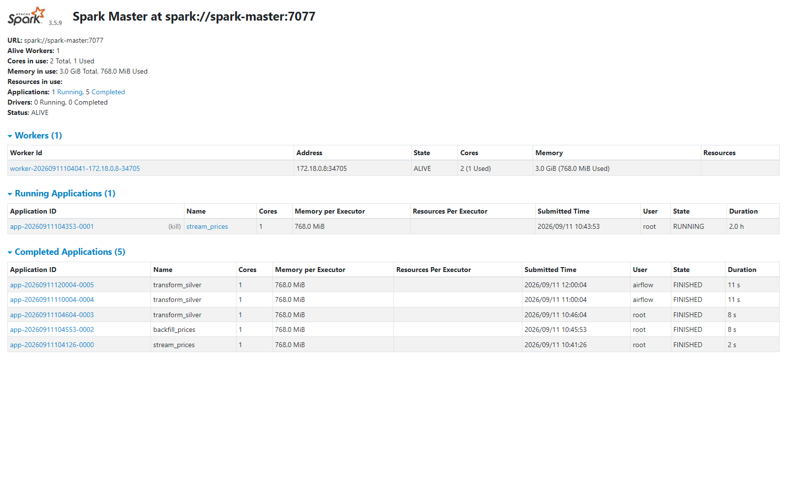

# Operations runbook

Practical commands for a running stack. Assumes `make up` has been executed and
the stack is healthy. For how the streaming path handles retries, duplicates,
ordering and the DLQ, see [event-driven-patterns.md](event-driven-patterns.md).

## Day-to-day

| What | Command |
| --- | --- |
| Start core stack | `make up` |
| Stop (keep data) | `make down` |
| Reset everything | `make clean` (deletes volumes) |
| Service status | `make ps` |
| Follow logs | `make logs` |
| Live SMARD ingest | `make live` (foreground; polls every 60 s) |
| Offline demo replay | `make demo` |
| Streaming job | `make stream` (foreground) |
| Batch backfill | `make backfill` |
| News enrichment (optional) | `make news` |
| Observability stack | `make obs` |

## Inspecting the platform

```bash
# Kafka topics and consumer lag
docker compose exec redpanda rpk topic list --brokers redpanda:9092
docker compose exec redpanda rpk topic consume energy.prices.raw --brokers redpanda:9092 --num 5

# Object storage (LocalStack S3)
docker compose exec localstack awslocal s3 ls s3://energy-lake/warehouse --recursive | head

# Iceberg tables via an interactive Spark SQL shell (local mode inside the container)
docker compose run --rm --entrypoint /opt/spark/bin/spark-sql spark-master \
  --master local[2] \
  --conf spark.sql.extensions=org.apache.iceberg.spark.extensions.IcebergSparkSessionExtensions \
  --conf spark.sql.catalog.lake=org.apache.iceberg.spark.SparkCatalog \
  --conf spark.sql.catalog.lake.type=jdbc \
  --conf spark.sql.catalog.lake.uri=jdbc:postgresql://postgres:5432/iceberg \
  --conf spark.sql.catalog.lake.jdbc.user=energy \
  --conf spark.sql.catalog.lake.jdbc.password=energy \
  --conf spark.sql.catalog.lake.warehouse=s3a://energy-lake/warehouse \
  --conf spark.hadoop.fs.s3a.endpoint=http://localstack:4566 \
  --conf spark.hadoop.fs.s3a.access.key=test \
  --conf spark.hadoop.fs.s3a.secret.key=test \
  --conf spark.hadoop.fs.s3a.path.style.access=true \
  --conf spark.hadoop.fs.s3a.connection.ssl.enabled=false \
  -e "SELECT count(*) AS hours, max(delivery_ts) AS latest FROM lake.energy.bronze_prices"

# Serving tables
docker compose exec postgres psql -U energy -d serving \
  -c "SELECT max(delivery_ts), count(*) FROM serving.price_hourly"

# Pipeline health
docker compose exec postgres psql -U energy -d serving \
  -c "SELECT * FROM serving.pipeline_health"
```

Web UIs (all local, default credentials):

| Service | URL | Notes |
| --- | --- | --- |
| Airflow | http://localhost:8088 | `admin` / `admin` |
| Grafana | http://localhost:3000 | `admin` / `admin` (`make obs`) |
| Prometheus | http://localhost:9090 | `make obs` |
| Spark master | http://localhost:8080 | cluster + apps |
| Spark worker | http://localhost:8081 | |

The Spark master UI after a few days of history (the long-running streaming
application plus the batch jobs submitted by Airflow):



## Failure modes and first checks

| Symptom | First check | Cause / fix |
| --- | --- | --- |
| `make stream` exits with "NoSuchBucket" | `docker compose logs localstack` | LocalStack volume was reset. `docker compose up -d` recreates the bucket via `localstack-init`; or run `make infra` |
| `make stream` exits with Iceberg "NotFoundException" for a metadata file | `docker compose exec postgres psql -U energy -d iceberg -c "SELECT * FROM iceberg_tables;"` | Split-brain: the Postgres catalog remembers tables whose files were lost with the LocalStack volume. Clear the stale entries (`DELETE FROM iceberg_tables WHERE table_namespace='energy';`) and restart the stream; `make backfill` + a transform rebuild the data |
| First Airflow Spark task slow | task log | Ivy resolves ~100 MB of connector jars once, then cached in the `ivy-cache` volume |
| DLQ topic growing | consume `energy.prices.invalid` | Producer schema drift; inspect messages and update `MESSAGE_SCHEMA` in `spark/jobs/stream_prices.py` |
| Serving table empty | `serve` after backfill | Batch/stream hasn't run yet; trigger `energy_batch_pipeline` in Airflow or `make backfill` |
| Health DAG failing | `serving.pipeline_health` | Freshness SLA is 3 h; streaming or hourly transform stopped |
| Port already in use | `netstat -ano \| findstr 8088` (Windows) | Another Postgres/Airflow instance running; stop it or remap ports in `docker-compose.yml` |
| Docker Desktop memory issues | Settings → Resources | Give Docker ≥ 8 GB RAM; Spark worker is capped at 2 GB |
| News job stores NULL categories | `make news` output | classifier.dev unreachable or rate-limited; headlines are kept and the next run reclassifies them (ADR 0003) |

## Data semantics worth remembering

- **`null` prices in SMARD responses are normal** - they are future hours of the
  current week, not data loss. The parser skips them.
- **Revisions are expected.** Ingestion is an upsert keyed by
  `(region, delivery_ts)` where the newest `fetched_at` wins; replaying data is
  always safe (see `docs/decisions/0002-revision-aware-upserts.md`).
- **Timestamps** are stored as UTC; the Berlin local hour is derived in the
  silver layer, where weekend/negative/peak flags live.
